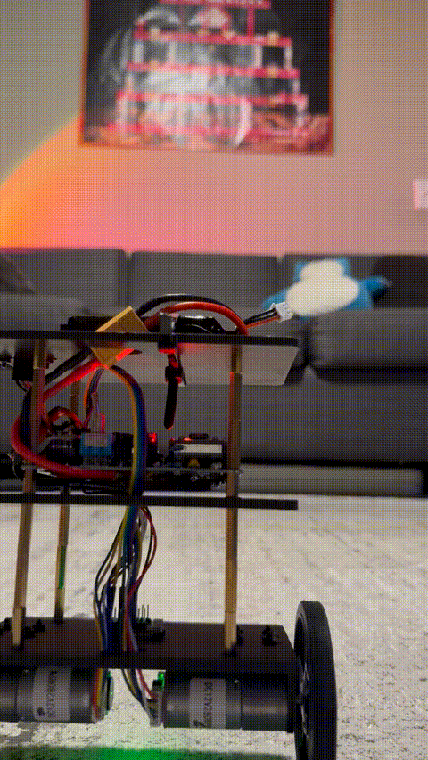

# ESP32 Self-Balancing Robot

A two-wheeled self-balancing robot built around an ESP32, an IMU, and a cascaded PID control loop — with a live WiFi tuning interface and a dedicated wireless joystick controller.


<!-- Replace with your actual video/gif — a short clip of it recovering + spinning in front of the camera is exactly the kind of proof-of-work that belongs here. -->

## Overview

This robot balances on two wheels using a complementary filter for orientation estimation and a two-loop (cascaded) PID controller: an inner loop holds the body upright, and an outer loop corrects for long-term drift by tracking wheel velocity from quadrature encoders. It can be driven and steered two ways — a phone/browser joystick served directly from the robot's own WiFi access point, or a dedicated physical ESP32 + analog-joystick controller communicating over ESP-NOW.

## Features

- **Cascaded PID control** — inner loop (angle) + outer loop (velocity/drift), tuned live rather than by reflashing
- **WiFi live-tuning webpage** — the ESP32 hosts its own access point and a WebSocket-driven page with sliders for every gain, calibration constant, and per-motor floor, plus a draggable on-screen joystick for driving
- **Physical joystick controller** — a second ESP32 reading an analog joystick, sending continuous steering data over ESP-NOW (no phone required, lower latency than WiFi)
- **Per-motor stiction compensation** — independently tunable output floors and a proportional rescale, since the two motors' real-world behavior isn't identical
- **Hysteresis-based deadband** — a Schmitt-trigger style engage/disengage threshold to suppress motor chatter at equilibrium without losing responsiveness to small corrections
- **Smoothly ramped inputs** — commanded lean/steer values slew toward their target instead of stepping instantly, avoiding derivative-kick spikes
- **OLED live telemetry** — angle, motor output, encoder-derived velocity, battery voltage, and a small tilt-indicator graphic

## Hardware

| Component | Notes |
|---|---|
| ESP32 dev board (x2) | one for the robot, one for the joystick controller |
| Adafruit LSM6DSOX | 6-axis IMU (accelerometer + gyro) |
| SSD1306 OLED (128x64, I2C) | onboard telemetry display |
| 2x DC motor + quadrature encoders | drive + odometry |
| Motor driver (dual H-bridge) | AIN1/AIN2, BIN1/BIN2 control |
| 2-axis analog joystick module | physical controller input |
| LiPo battery + voltage divider | robot power + monitoring via `analogReadMilliVolts()` |

## Architecture

```
IMU (accel + gyro) ──► complementary filter ──► angle estimate
                                                     │
                          ┌──────────────────────────┘
                          ▼
              inner loop: PID(Kp, Ki, Kd) on angle error
                          │
              outer loop: velocity/drift correction
              (encoder-derived velocity → Kp_vel/Ki_vel → shifts
               the angle setpoint to correct long-term drift)
                          │
                          ▼
        per-motor floor rescale + hysteresis deadband
                          │
                          ▼
                   motorA() / motorB() (PWM)
```

Input arrives from either the WebSocket ('J:x:y' from the webpage joystick, or discrete gain/calibration updates from the tuning sliders) or ESP-NOW (the physical joystick controller) — both write into the same `targetAngleTrim`/`steerBias` variables, so the control loop doesn't care which source is driving it.

## Setup

Each firmware is its own PlatformIO project.

**Robot** (`robot/`):
1. `pio run --target upload` from within `robot/`
2. Power on, open the serial monitor (115200 baud) — it prints the WiFi AP IP and its ESP-NOW MAC address
3. Connect a phone/laptop to the `BalanceBot` AP and open `http://<AP IP>/` for the tuning page

**Controller** (`controller/`):
1. Wire the joystick module: VRx→GPIO34, VRy→GPIO35, SW→GPIO32, VCC→3.3V, GND→GND
2. Set `robotMac[]` in `controller/src/main.cpp` to the robot's printed AP MAC address
3. Confirm `WIFI_CHANNEL` matches between both projects
4. `pio run --target upload` from within `controller/`

Both projects are pinned to the same platform version (see each `platformio.ini`) — this matters, since ESP-NOW callback signatures changed between core versions and mismatched cores between the two boards can cause hard-to-diagnose link failures.

## Debugging notes / what I actually learned building this

This is the part I'd want an interviewer to read, honestly — the balancing itself came together fast; getting it *stable and controllable* took real diagnosis:

- **Output floor destroyed proportionality.** A flat "snap any nonzero output up to the motor's stiction floor" made the controller bang-bang, not proportional, for the entire range under a few degrees of error — the majority of actual operating time. Fixed by rescaling the output range onto `[MIN_OUTPUT, MAX_OUTPUT]` per motor instead of snapping.
- **Encoder velocity math is a real kinematics problem, not an arbitrary sign choice.** Diagnosing whether `avgVelocity` should combine the two encoders by addition or subtraction meant understanding what each raw sign actually meant physically (translation vs. yaw), not just trying both and picking whichever "looked less bad." Verified empirically with a manual push test (motors disabled, print raw deltas) rather than guessing.
- **A control loop can have the wrong sign of an otherwise-correct formula.** Reversing the encoder combination made the outer loop feed real motion back into itself as *positive* feedback instead of negative — the difference between correcting drift and amplifying it into a runaway, from one flipped sign.
- **Deadbands need hysteresis, not a single threshold.** A flat deadband still has exactly one crossing point, and standing-still equilibrium sits right on top of it — sensor noise flickering across that single threshold was the actual jitter, not "too much" or "too little" deadband. A two-threshold (engage/disengage) hysteresis fixed it structurally instead of by tuning a magic number.
- **A hard on/off switch in a control loop creates a real discontinuity.** Suppressing the outer loop during a turn (to stop it reacting to a turn-induced phantom velocity reading) fixed the turn-tipping, but re-enabling it instantly the moment steering stopped caused a visible jerk — full-strength correction plus whatever stale value existed applied in a single tick. Replaced with a ramped suppression factor.

## Known limitations / open items

- `ANGLE_TRIM_DEG` (the sensor-to-mechanical zero offset) drifts somewhat run-to-run; auto-calibration was considered but not implemented.
- Turning still relies on suppressing the outer loop rather than a from-first-principles kinematic decoupling of translation and rotation.
- No IMU cross-axis leakage compensation (untested whether it's actually present on this build).
